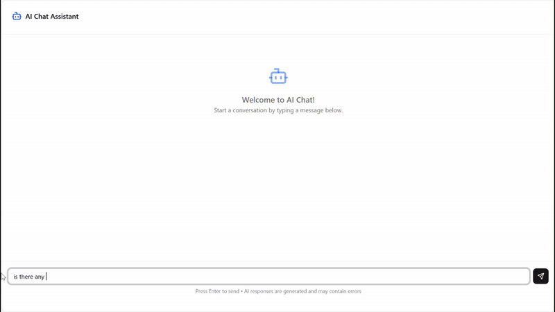
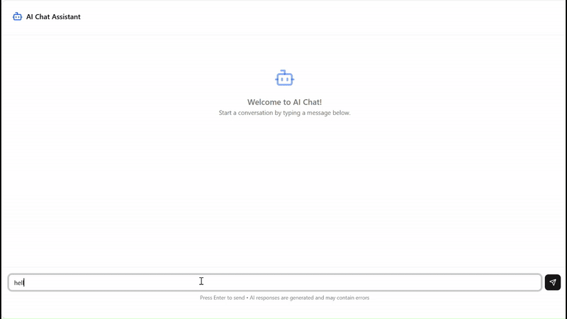
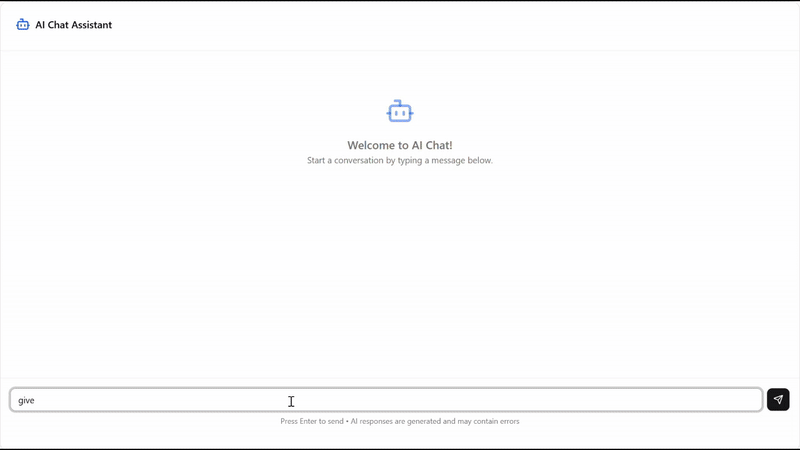
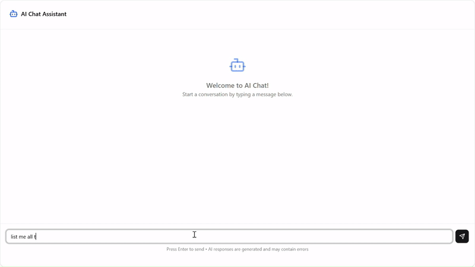

# MCP GitLab Server

A Model Context Protocol (MCP) server built with Java Spring Boot that provides GitLab integration tools. This server allows AI models to interact with GitLab repositories, pipelines, issues, and branches through a standardized interface.

## Features

- **Project Management**: List owned GitLab projects
- **Pipeline Operations**: Get pipeline information and retry failed pipelines
- **Issue Tracking**: Retrieve open issues for projects
- **Branch Management**: List all branches for a project
- **RESTful Integration**: Built with Spring Boot for robust API handling

## Prerequisites

- Java 17 or higher
- Maven 3.6+
- GitLab account with API access
- GitLab Personal Access Token

## Gallery

Ask him about open issues in your projects:


Tell him to list your projects on gitlab:


Ask him about pipelines and he can also retry them for you: 


Ask him information about branches:


## Installation

1. Clone the repository:
```bash
git clone <repository-url>
cd mcp-gitlab-server
```

2. Configure your GitLab credentials in `application.properties`:
```properties
gitlab.api.token=your-gitlab-token-here
gitlab.api.url=https://gitlab.com/api/v4
```

3. Build the project:
```bash
mvn clean install
```

4. Run the server:
```bash
mvn spring-boot:run
```

## Configuration

### Environment Variables

| Variable | Description | Default |
|----------|-------------|---------|
| `gitlab.api.token` | GitLab Personal Access Token | Required |
| `gitlab.api.url` | GitLab API base URL | `https://gitlab.com/api/v4` |

### GitLab Token Setup

1. Go to GitLab → Profile → Access Tokens
2. Create a new token with the following scopes:
    - `api` - Access the authenticated user's API
    - `read_repository` - Read repository content
    - `read_user` - Read user information

## Available Tools

### 1. Get Owned Projects
```java
@Tool(description = "This function list all the project inside gitlab account")
public List<GitLabProject> getOwnedProjects()
```
Returns all projects owned by the authenticated user.

### 2. Get Project Pipelines
```java
@Tool(description = "Get all pipeline information for a GitLab project by its ID")
public List<Object> getPipelinesForProject(Long projectId)
```
Retrieves all pipelines for a specific project.

### 3. Get Open Issues
```java
@Tool(description = "Get all open issues for a GitLab project by its ID")
public List<Object> getOpenIssuesForProject(Long projectId)
```
Lists all open issues for a project.

### 4. List Branches
```java
@Tool(description = "List all branches for a GitLab project by its ID")
public List<Object> getBranches(Long projectId)
```
Returns all branches for a specific project.

### 5. Retry Pipeline
```java
@Tool(description = "Retry GitLab pipeline by project ID and pipeline ID")
public void retryPipeline(Long projectId, Long pipelineId)
```
Retries a failed or cancelled pipeline.

## Project Structure

```
src/
├── main/
│   ├── java/
│   │   └── com/achrafelaffas/mcpserver/
│   │       ├── tools/
│   │       │   └── GitlabTools.java
│   │       └── entity/
│   │           └── GitLabProject.java
│   └── resources/
│       └── application.properties
├── client/                 # MCP Java client
└── ui/              # React interface
```

## Architecture

### MCP Server (Spring Boot)
- Implements GitLab API integration
- Provides tools as Spring AI annotations
- Handles authentication and HTTP requests
- RESTful endpoints for external access

### MCP Client (Java)
- Connects to the MCP server
- Handles protocol communication
- Provides Java interface for tool usage

### React Frontend
- User interface for interacting with GitLab tools

## Usage Examples

### Getting Projects
```java
// The MCP server will automatically expose this as a tool
List<GitLabProject> projects = gitlabTools.getOwnedProjects();
```

### Checking Pipeline Status
```java
// Get pipelines for a specific project
List<Object> pipelines = gitlabTools.getPipelinesForProject(12345L);
```

### Retrying Failed Pipeline
```java
// Retry a specific pipeline
gitlabTools.retryPipeline(12345L, 67890L);
```

## Security Considerations

- **Never commit your GitLab token** to version control
- Use environment variables or secure configuration management
- Implement proper authentication for the MCP server
- Consider rate limiting for API calls

## Development

### Adding New Tools

1. Create a new method in `GitlabTools.java`
2. Add the `@Tool` annotation with description
3. Implement the GitLab API call logic
4. Test the tool functionality

## Contributing

1. Fork the repository
2. Create a feature branch
3. Commit your changes
4. Push to the branch
5. Create a Pull Request

## License

This project is licensed under the MIT License - see the LICENSE file for details.

## Support

For questions or issues:
- Create an issue in the repository
- Contact the development team
- Check the documentation

## Changelog

### v1.0.0
- Initial release
- Basic GitLab integration tools
- MCP server implementation
- React frontend interface
